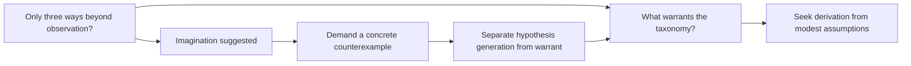
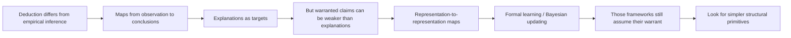
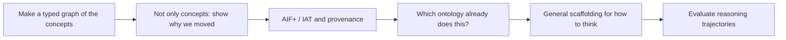
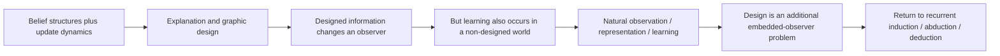

# How this inquiry moved

This is a curator's reconstruction of the visible dialogue, not hidden chain of thought. Detailed moves and quotes are in [the report](../examples/seed/report.md); underlying IDs begin `dialogue-2026-09-27:`. The smaller diagrams below are explanatory views, not extra graph facts.

## 1. A taxonomy became a warrant problem

The important state change was not “learned about imagination.” An assistant's proposed extra category was challenged and retracted. The original exhaustiveness question remained. Trace `n:imagination` for that history; inspect `n:q-warrant` and `n:q-exhaustive` for the new obligations.

## 2. The target was widened and then moved beneath algorithms

The Bayes objection challenged the proposed grounding, not the algebra of conditional probability. The “wrong abstraction” objection challenged using unconstrained algorithm classes as the answer to a request for a simple inference classification. Both distinctions matter when deciding what question was actually left open.

## 3. Pattern recognition became a representation/measurement problem

```mermaid
flowchart LR
 A[Physically realizable recognizers] --> B[Wolfram / Hoel / coarse-graining]
 B --> C[Recognition versus projection]
 C --> D[Dots: a relation can become explicit without a future prediction]
 D --> E[Loose lift / higher-order terminology challenged]
 E --> F[Relation extraction differs from coarse-graining]
 F --> G[Bronstein: invariance and stability]
 G --> H[Which perceptual dimensions can an observer access?]
 H --> I[Measurement + sensors + memory]
```

The dots example is an example node linked to a hypothesis and a subsequent question. It is not automatically a theorem that all recognition is induction. The physically possible versus epistemically warranted distinction is preserved separately. See [seed review](seed-review.md) for the information-theoretic caveat.

## 4. A concept map became a map of inquiry

This pivot defines the product. The graph needs activities, source occurrences, changes and open questions—not merely entities joined by “related to.” Speaker lanes can be hidden in a display, but attribution must remain in the stored graph.

## 5. Communication was situated inside a broader observer problem

A framing that assumed a designer was corrected. This does not erase the communication application; it places it within a more general natural-learning question. The map also records the return to the original inference loop rather than presenting all topics as a one-way linear pipeline.

## 6. Open obligations became the product requirement

The induction foundation, abduction foundation, exhaustive taxonomy, physically available distinctions and ontology-reuse questions were not settled. Recognizing that these obligations were still open motivated the cross-conversation inquiry graph and the V1 request.

The implemented agenda does not pick one mathematically optimal next question. It makes the open branches visible, with provenance, so that the user and a later policy can choose explicitly. The distinction between an agenda and an optimizer is intentional.
