# How this inquiry moved

This is a curator's reconstruction of the visible dialogue, not hidden chain of thought. Detailed moves and quotes are in [the report](../examples/seed/report.md); underlying IDs begin `dialogue-2026-09-27:`. The smaller diagrams below are explanatory views, not extra graph facts.

## 1. A taxonomy became a warrant problem

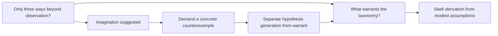

The important state change was not “learned about imagination.” An assistant's proposed extra category was challenged and retracted. The original exhaustiveness question remained. Trace `n:imagination` for that history; inspect `n:q-warrant` and `n:q-exhaustive` for the new obligations.

## 2. The target was widened and then moved beneath algorithms

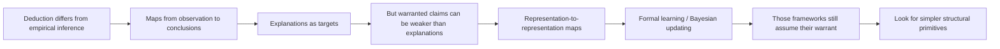

The Bayes objection challenged the proposed grounding, not the algebra of conditional probability. The “wrong abstraction” objection challenged using unconstrained algorithm classes as the answer to a request for a simple inference classification. Both distinctions matter when deciding what question was actually left open.

## 3. Pattern recognition became a representation/measurement problem

```mermaid
flowchart LR
 A[Physically realizable recognizers] --> B[Wolfram / Hoel / coarse-graining]
 B --> C[Recognition versus projection]
 C --> D[Dots: a relation can become explicit without a future prediction]
 D --> E[Loose lift / higher-order terminology challenged]
 E --> F[Relation extraction differs from coarse-graining]
 F --> G[Bronstein: invariance and stability]
 G --> H[Which perceptual dimensions can an observer access?]
 H --> I[Measurement + sensors + memory]
```

The dots example is an example node linked to a hypothesis and a subsequent question. It is not automatically a theorem that all recognition is induction. The physically possible versus epistemically warranted distinction is preserved separately. See [seed review](seed-review.md) for the information-theoretic caveat.

## 4. A concept map became a map of inquiry

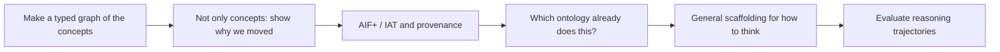

This pivot defines the product. The graph needs activities, source occurrences, changes and open questions—not merely entities joined by “related to.” Speaker lanes can be hidden in a display, but attribution must remain in the stored graph.

## 5. Communication was situated inside a broader observer problem

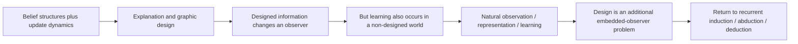

A framing that assumed a designer was corrected. This does not erase the communication application; it places it within a more general natural-learning question. The map also records the return to the original inference loop rather than presenting all topics as a one-way linear pipeline.

## 6. Open obligations became the product requirement

The induction foundation, abduction foundation, exhaustive taxonomy, physically available distinctions and ontology-reuse questions were not settled. Recognizing that these obligations were still open motivated the cross-conversation inquiry graph and the V1 request.

The implemented agenda does not pick one mathematically optimal next question. It makes the open branches visible, with provenance, so that the user and a later policy can choose explicitly. The distinction between an agenda and an optimizer is intentional.

## 7. Measurement and Pattern Theory were tested as the missing layer

```mermaid
flowchart LR
 A[Is this just measurement theory?] --> B[Measurement gives accessible variables]
 B --> C[But patterns are structures over measurements]
 C --> D[Search existing pattern theory]
 D --> E[Grenander / Brown Pattern Theory]
 E --> F[Bronstein explicitly demoted]
 F --> G[Pattern Theory useful but not foundationally complete]
 G --> H[Predictive / causal equivalence explored]
 H --> I[User objects: good abstraction is not all possible noticing]
```

This stage contains two important *negative* results. First, geometric deep learning was not kept in the spine merely because it had been mentioned earlier. Second, causal-state / predictive-equivalence ideas were demoted from a proposed ontology of patterns to criteria for useful or sufficient representation. Those corrections are represented rather than silently overwritten.

## 8. The dots example separated integration, representation, learning, and induction

```mermaid
flowchart LR
 A[No individual sensor carries the whole relation] --> B[Joint information / integration]
 B --> C[IIT considered only algorithmically]
 C --> D[Spatial dots are temporalized]
 D --> E[Memory as temporal integration]
 E --> F[Stateful computation substrate]
 F --> G[Pattern extraction may be deductive]
 G --> H[So pattern recognition is not automatically induction]
```

The temporal-dots move was especially productive: distributing the same evidence over time showed that “integration” and “memory” can share a substrate without making either identical to learning or induction. The later correction `pattern-not-induction` explicitly challenges the earlier `recognition-is-projection` and `induction-first` hypotheses.

## 9. The dialogue reset to the original warrant problem

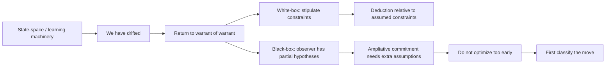

A wording correction matters here: the embedded observer does not need to “know” the model. The graph records `assumed-not-known`; deductions are conditional on currently assumed constraints. “Warrant” is used as a conditional license or guarantee, not as certainty.

## 10. MECE became a property of the representation, then a composition space

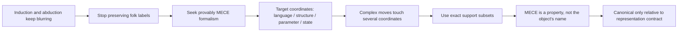

The move from one-target categories to a **composition space** was a user correction. A joint claim can concern several model coordinates simultaneously; forcing it into one bucket would lose information. The graph therefore keeps `model-target-composition` distinct from the later state-update basis.

## 11. State change simplified to additions, deletions, representation change, and support change

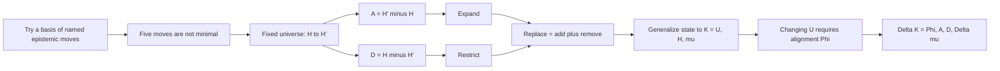

This is the strongest current structural result. The fixed-universe hard-update factorization is complete by set difference. The broader claim is conditional on the semantic alignment Φ; the graph does not promote it to a universal theorem of cognition.

## 12. Candidate generation, warrant, and state update split apart

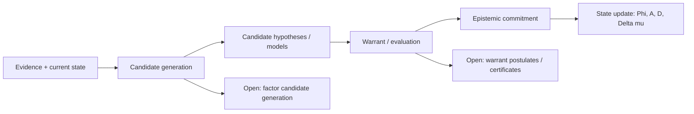

The current endpoint is not “induction and abduction solved.” It is the separation:

[
\text{candidate generation}
\neq
\text{warrant/evaluation}
\neq
\text{state update}.
]

Traditional induction, abduction, analogy, model invention, and causal discovery are now treated primarily as candidate-generation or reasoning-trajectory motifs until a stronger factorization is found. The warrant layer records explicit assumptions and the guarantee they are claimed to buy. The state-update layer records the resulting semantic change.

The two most important open obligations are now `q-candidate-generation-factorization` and `q-warrant-postulates`. See [the current research draft](epistemic-transition-calculus.md) and [post-V1 research log](research-log-post-v1.md).

## 13. The conversation itself became a test case for candidate generation

~~~mermaid
flowchart LR
 A[What kind of reasoning are we doing here?] --> B[Theoretical model construction]
 B --> C[Use the dialogue as a candidate-generation corpus]
 C --> D[Provisional operators: compose / abstract / reframe...]
 D --> E[User objects: reframe is doing too much]
 E --> F[Separate construction inside a concept space from invention of new concepts]
~~~

This phase turned the inquiry back onto itself. The dialogue was no longer only discussing candidate generation abstractly; it became an example to classify. The informal operator list was intentionally not frozen into the ontology.

## 14. Concept formation exposed an overloaded meta-model

~~~mermaid
flowchart LR
 A[Concept construction vs concept invention] --> B[Check existing formal machinery]
 B --> C[Description logics / FCA / anti-unification / predicate invention]
 C --> D[U is overloaded]
 D --> E[Separate signature, sentences, models, assumptions]
 E --> F[Institution theory]
 F --> G[Reframe demoted to dialogue macro]
~~~

The important outcome was not another seven-item taxonomy. It was a sharper type distinction: constructing an expression in an existing language, adding a conservative definition, and inventing genuinely new vocabulary are different operations. Institution theory supplied a formal language/model boundary rather than another home-grown notation.

## 15. The white-box/black-box distinction corrected the “current theory” idea

~~~mermaid
flowchart LR
 A[Intermediate T/W model] --> B[User: I am not committing to one theory]
 B --> C[Assume this only for the derivation]
 C --> D[Persistent alternatives]
 C --> E[Temporary active assumptions]
 D --> F[Black-box state]
 E --> G[White-box branch]
~~~

This was another user correction. A set of premises used for a deduction should not automatically be modeled as the observer's durable belief theory. The distinction between **persistent epistemic organization** and **temporarily stipulated assumptions** became explicit.

## 16. ATMS and institutions became complementary foundations

~~~mermaid
flowchart LR
 A[Research assumption-based reasoning] --> B[ATMS: assumptions + justifications + environments]
 B --> C[Minimal support labels]
 C --> D[Persistent K_sigma = N,A,J,lambda,rho]
 D --> E[Select Gamma for one reasoning branch]
 E --> F[Closure C(Gamma)]
 G[Institution theory] --> H[Signature / sentences / models / satisfaction]
 H --> I[Signature morphisms for language change]
 F --> J[Reasoning episode R = K_sigma,Gamma,Q]
 I --> J
 J --> K[Typed candidate generation remains open]
~~~

The two frameworks solve different pieces. Institution theory constrains representational/logical translation. ATMS-like machinery preserves multiple hypothetical contexts and explicit dependency provenance. Query \(Q\) is now outside persistent epistemic state; evidence is represented as typed, provenance-bearing content rather than an automatically privileged bucket.

The current endpoint is documented in [assumption-context-meta-model.md](assumption-context-meta-model.md). The open frontier is still the typed algebra of candidate generation, not another attempt to declare induction/abduction primitives.
