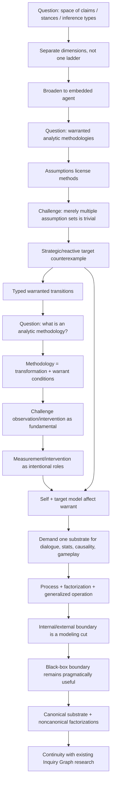

# Formal inquiry trajectory map

```mermaid
flowchart TD
  Q1["Question: space of claims / stances / inference types"]
  D["Separate dimensions, not one ladder"]
  E["Broaden to embedded agent"]
  Q2["Question: warranted analytic methodologies"]
  A["Assumptions license methods"]
  C["Challenge: merely multiple assumption sets is trivial"]
  S["Strategic/reactive target counterexample"]
  T["Typed warranted transitions"]
  Q3["Question: what is an analytic methodology?"]
  M["Methodology = transformation + warrant conditions"]
  I["Challenge observation/intervention as fundamental"]
  R["Measurement/intervention as intentional roles"]
  ST["Self + target model affect warrant"]
  Q4["Demand one substrate for dialogue, stats, causality, gameplay"]
  P["Process + factorization + generalized operation"]
  CUT["Internal/external boundary is a modeling cut"]
  B["Black-box boundary remains pragmatically useful"]
  K["Canonical substrate + noncanonical factorizations"]
  REPO["Continuity with existing Inquiry Graph research"]

  Q1 --> D --> E --> Q2 --> A
  A --> C --> S --> T --> Q3 --> M --> I --> R --> ST --> Q4 --> P
  P --> CUT --> B --> K --> REPO
  S --> ST
```

This is a readable projection of `graph.json`, not a replacement for the canonical JSON records.
