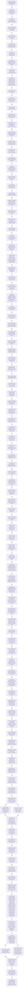

# Recorded inquiry moves

Temporal succession is not causation. All annotations are proposed; source attribution remains in graph.json.

```mermaid
flowchart TD
  n0["move: ask: Do deduction, induction and abduction exhaust learning beyond observation?"]
  n1["move: propose: Imagination might contribute an additional way to learn beyond observation."]
  n2["move: challenge: Can imagination yield knowledge not reducible to inference or introspection?"]
  n3["move: retract: Imagination can generate candidates without independently justifying them."]
  n4["move: reframe: What warrants the standards by which an inference is warranted?"]
  n5["move: scope: Derive a taxonomy from modest explicit assumptions rather than simply assuming it."]
  n6["move: ask: Can exhaustiveness of the proposed inference taxonomy be proved?"]
  n7["move: distinguish: Deduction and inference by an embedded empirical observer have different dependencies."]
  n8["move: reframe: Which beyond-observation inferences can an embedded observer make?"]
  n9["move: hypothesize: Induction concerns empirical patterns while abduction concerns mechanisms.; A Bayesian or causal DAG as a candidate representation of inferential relationships."]
  n10["move: ask: How is latent structure different from a mechanism?"]
  n11["move: clarify: An unobserved explanatory variable need not specify the process by which an effect occurs."]
  n12["move: ask: What is the space of possible explanatory hypotheses?"]
  n13["move: reframe: What claims beyond observation can have support without being explanations?"]
  n14["move: hypothesize: The relevant map may run between representations rather than raw observations and concepts."]
  n15["move: reframe: What possible maps take current representations beyond the information currently explicit?"]
  n16["move: scope: Anchor the investigation in existing formal theories rather than reinventing terminology."]
  n17["move: propose: Model an inference method as a function from evidence histories to hypotheses."]
  n18["move: challenge: Does Bayesian updating explain warrant or merely relocate assumptions?"]
  n19["move: clarify: Conditionalization presupposes a hypothesis space, likelihoods and priors; it does not ground all of them."]
  n20["move: connect: Classes of evidence-to-conclusion mappings with shared properties."]
  n21["move: challenge: Is algorithm classification the right level for a simple inference taxonomy?"]
  n22["move: hypothesize: Assume an external reality with sufficiently stable rules."]
  n23["move: propose: Entailment, projection along stable structure and inversion toward generators may recover three inference forms."]
  n24["move: ask: What minimal entities and relations does this inference sketch require?"]
  n25["move: ask: Is structure a set of constraints, or does emergence and computational irreducibility change the ontology?"]
  n26["move: distinguish: God-view versus embedded-observer perspective."]
  n27["move: hypothesize: Inductive pattern recognition could initialize a loop through abduction and deduction."]
  n28["move: challenge: Recognizing a sample pattern and licensing its extension beyond the sample are distinct operations."]
  n29["move: clarify: Physically realizable pattern recognition, rather than normatively justified recognition.; Which pattern-recognition mappings can physical embedded observers implement?"]
  n30["move: connect: Does Wolfram observer theory characterize physically realizable pattern recognizers?"]
  n31["move: connect: Hoel, causal emergence, coarse-graining and entropy, raised as related work."]
  n32["move: challenge: Recognizing a pattern may itself perform the relevant beyond-token representational step."]
  n33["move: propose: Recognizing spatial separation of black and white dots from individual positions and colors.; What operation makes a relational feature explicit to an observer?"]
  n34["move: propose: Representational lift may be a primitive operation prior to prediction."]
  n35["move: challenge: What does higher order mean, and how does it differ from coarse-graining?"]
  n36["move: clarify: Extracting relations is not necessarily a many-to-one, information-discarding coarse-graining."]
  n37["move: connect: Bronstein and geometric deep learning as a candidate framework for learning primitives."]
  n38["move: ask: Can symmetry, invariance and stability supply primitives of pattern recognition?"]
  n39["move: propose: Symmetry, deformation stability and scale separation/locality as geometric learning priors."]
  n40["move: reframe: Which dimensions of perceptual space are available to a physically embedded observer?"]
  n41["move: propose: Sensors determine accessible distinctions, while memory enables relations across time."]
  n42["move: propose: Represent the conversation with typed entities and relation roles."]
  n43["move: reframe: Map the moves that changed the inquiry, not only the concepts mentioned."]
  n44["move: connect: AIF+ and Inference Anchoring Theory as candidate dialogue/argument representations."]
  n45["move: ask: Which existing ontology captures temporal inquiry evolution and reasoning moves?"]
  n46["move: propose: Combine AIF/IAT argument and dialogue structure with provenance and inquiry-transition records."]
  n47["move: connect: What general heuristics or formal scaffolding improve thinking across problems?"]
  n48["move: propose: Evaluate reasoning-move trajectories and learn which strategies work under which conditions."]
  n49["move: connect: Belief change depends on existing representations and an agent-specific updating process."]
  n50["move: challenge: Observed conversations underdetermine a person's internal beliefs and update mechanism."]
  n51["move: connect: What general dynamics make explanations and visual presentations effective?"]
  n52["move: propose: Treat communication as a designed transformation of a recipient representation."]
  n53["move: reframe: How does an embedded observer learn from a non-designed world?"]
  n54["move: hypothesize: Optimal explanation or design is a further problem for an observer with an uncertain model of other observers."]
  n55["move: retract: Natural learning need not assume a designer; deliberate communication is an additional case."]
  n56["move: connect: Induction, abduction and deduction can feed back into one another rather than forming a fixed pipeline."]
  n57["move: summarize: What assumptions minimally support inductive generalization?"]
  n58["move: summarize: What assumptions and criteria support abductive model selection?"]
  n59["move: propose: Build a persistent cross-conversation map of worldview, questions, dependencies and revisions."]
  n60["move: clarify: An open node is an unresolved question or epistemic obligation, not just a mentioned topic."]
  n61["move: scope: Deliver a coherent first-pass ontology, conversation instantiation, code and project documentation in GitHub."]
  n62["move: ask: Is measurement theory sufficient to explain the observer-to-pattern problem?"]
  n63["move: clarify: Measurement theory can characterize accessible measured variables without by itself characterizing every structure recognized over those measurements."]
  n64["move: connect: Grenander/Brown Pattern Theory as a candidate formal language for generators, configurations, transformations, variation, observation and inference."]
  n65["move: challenge: Bronstein/geometric deep learning should not be part of the foundational spine merely because it was suggested earlier."]
  n66["move: challenge: Pattern Theory supplies broad representational and inferential machinery but does not by itself derive all observer representations from physics."]
  n67["move: challenge: What, if anything, is fundamental about pattern formation before criteria for useful or optimal abstraction are imposed?"]
  n68["move: clarify: Equivalence under predictive or causal consequence is better treated as a relevance or model-selection criterion than as the ontology of all patterns."]
  n69["move: ask: What is the minimal formalization of learning relevant to this inquiry?"]
  n70["move: distinguish: Pattern recognition or relational feature extraction from a fully observed finite configuration need not be inductive."]
  n71["move: connect: Distributed measurements may support joint relational representations not encoded by any individual sensor."]
  n72["move: clarify: IIT is considered only for algorithmic partition, irreducibility and cause-effect-structure machinery, not for consciousness claims."]
  n73["move: hypothesize: Memory can be treated abstractly as integration of measurements distributed across time."]
  n74["move: hypothesize: Stateful computation over an information stream is a general substrate for memory and integration, but does not by itself settle epistemic warrant."]
  n75["move: reframe: How should warrant of warrant be formalized once certainty is removed from the target?"]
  n76["move: summarize: The inquiry should return from implementation-level pattern and learning theories to the original warrant question."]
  n77["move: hypothesize: Ampliative warrant requires assumptions or constraints beyond bare logical entailment from finite evidence."]
  n78["move: connect: External reality plus partial observation plus logic yields a set of compatible possibilities, not by itself a unique ampliative conclusion."]
  n79["move: ask: What role does generation of candidate constraints play in black-box inference?"]
  n80["move: challenge: Choosing an optimal hypothesis is downstream of first characterizing the kinds of epistemic moves available."]
  n81["move: reframe: Under what conditions does evidence E contain information relevant to a proposition H?"]
  n82["move: distinguish: For an embedded observer, constraints used in derivations should be described as assumed rather than known."]
  n83["move: ask: Can the apparent overlap between induction and abduction be explained by a deeper compositional formalism?"]
  n84["move: clarify: A constraint is broader than an explanation or mechanism; empirical, causal and explanatory commitments can occupy different levels."]
  n85["move: scope: Construct a coherent formalism for epistemic moves without preserving historical inference labels when they obscure the structure."]
  n86["move: propose: Relative to a current epistemic state, entailment versus non-entailment is an immediate MECE logical split."]
  n87["move: clarify: Make exhaustiveness and non-overlap provable by construction rather than asserted from a folk taxonomy."]
  n88["move: ask: Can ampliative epistemic moves be represented in a provably MECE or uniquely factorizable way?"]
  n89["move: propose: Model-target effects can be represented as an exact subset of language, structure, parameter and state coordinates rather than one exclusive target."]
  n90["move: ask: What factorization of epistemic state change can be canonical relative to an explicit representation contract?"]
  n91["move: clarify: MECE is a desired property of the formalism, not the name of the formal object."]
  n92["move: propose: Construct a canonical factorization of epistemic transitions relative to an explicit semantic representation contract."]
  n93["move: reframe: Classify hypothesis and model moves without requiring certainty or strong knowledge claims."]
  n94["move: clarify: Develop a formal compositional calculus of hypothesis-space transformations with a separate warrant layer."]
  n95["move: challenge: The earlier five proposed move types were not a minimal state-update basis."]
  n96["move: propose: For a fixed hypothesis universe, hard live-set changes reduce to additions and deletions; preserve, restrict, expand and replace are derived cases."]
  n97["move: decompose: Candidate generation maps current state and evidence to candidate propositions, models or structures before evaluation and commitment.; Warrant evaluates whether a candidate-to-commitment move has a specified justification or guarantee under explicit assumptions.; Epistemic state change can be factored, relative to semantic alignment, into representation-space change, additions, deletions and graded-support change."]
  n98["move: propose: U: the current semantic universe or model space of expressible hypotheses.; H: the currently live hypotheses or possibilities within U.; mu: optional graded support or plausibility over live hypotheses."]
  n99["move: summarize: Epistemic state change can be factored, relative to semantic alignment, into representation-space change, additions, deletions and graded-support change."]
  n100["move: ask: Can candidate generation be given a small compositional or uniquely factorizable basis?"]
  n101["move: summarize: Current endpoint: factor epistemic state change relative to a representation contract, keep warrant separate, and treat candidate-generation factorization as open."]
  n102["move: propose: A warrant certificate records explicit assumptions, a claimed guarantee and support connecting the assumptions to that guarantee."]
  n103["move: clarify: Nontrivial ampliative guarantees require restrictions on the admissible possible-world or problem class."]
  n104["move: clarify: Warrant evaluates whether a candidate-to-commitment move has a specified justification or guarantee under explicit assumptions."]
  n0 -->|then| n1
  n1 -->|then| n2
  n2 -->|then| n3
  n3 -->|then| n4
  n4 -->|then| n5
  n5 -->|then| n6
  n6 -->|then| n7
  n7 -->|then| n8
  n8 -->|then| n9
  n9 -->|then| n10
  n10 -->|then| n11
  n11 -->|then| n12
  n12 -->|then| n13
  n13 -->|then| n14
  n14 -->|then| n15
  n15 -->|then| n16
  n16 -->|then| n17
  n17 -->|then| n18
  n18 -->|then| n19
  n19 -->|then| n20
  n20 -->|then| n21
  n21 -->|then| n22
  n22 -->|then| n23
  n23 -->|then| n24
  n24 -->|then| n25
  n25 -->|then| n26
  n26 -->|then| n27
  n27 -->|then| n28
  n28 -->|then| n29
  n29 -->|then| n30
  n30 -->|then| n31
  n31 -->|then| n32
  n32 -->|then| n33
  n33 -->|then| n34
  n34 -->|then| n35
  n35 -->|then| n36
  n36 -->|then| n37
  n37 -->|then| n38
  n38 -->|then| n39
  n39 -->|then| n40
  n40 -->|then| n41
  n41 -->|then| n42
  n42 -->|then| n43
  n43 -->|then| n44
  n44 -->|then| n45
  n45 -->|then| n46
  n46 -->|then| n47
  n47 -->|then| n48
  n48 -->|then| n49
  n49 -->|then| n50
  n50 -->|then| n51
  n51 -->|then| n52
  n52 -->|then| n53
  n53 -->|then| n54
  n54 -->|then| n55
  n55 -->|then| n56
  n56 -->|then| n57
  n57 -->|then| n58
  n58 -->|then| n59
  n59 -->|then| n60
  n60 -->|then| n61
  n61 -->|then| n62
  n62 -->|then| n63
  n63 -->|then| n64
  n64 -->|then| n65
  n65 -->|then| n66
  n66 -->|then| n67
  n67 -->|then| n68
  n68 -->|then| n69
  n69 -->|then| n70
  n70 -->|then| n71
  n71 -->|then| n72
  n72 -->|then| n73
  n73 -->|then| n74
  n74 -->|then| n75
  n75 -->|then| n76
  n76 -->|then| n77
  n77 -->|then| n78
  n78 -->|then| n79
  n79 -->|then| n80
  n80 -->|then| n81
  n81 -->|then| n82
  n82 -->|then| n83
  n83 -->|then| n84
  n84 -->|then| n85
  n85 -->|then| n86
  n86 -->|then| n87
  n86 -->|then| n88
  n87 -->|then| n89
  n88 -->|then| n89
  n89 -->|then| n90
  n90 -->|then| n91
  n91 -->|then| n92
  n92 -->|then| n93
  n93 -->|then| n94
  n94 -->|then| n95
  n95 -->|then| n96
  n96 -->|then| n97
  n97 -->|then| n98
  n98 -->|then| n99
  n99 -->|then| n100
  n99 -->|then| n101
  n100 -->|then| n102
  n101 -->|then| n102
  n102 -->|then| n103
  n103 -->|then| n104
```
